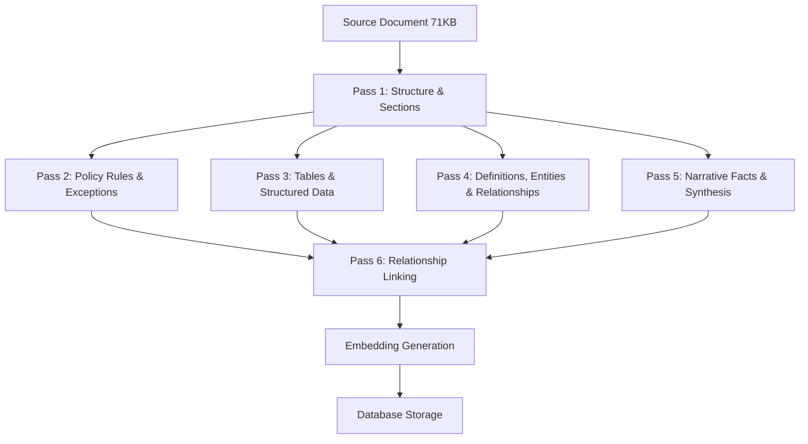

# RAG Ingestion Audit & Upgrade Report v1.0

**Date:** February 15, 2026  
**Author:** AI Assistant (Antigravity)  
**Source Document:** `Sun-Chip-Bank-Policy-Document-v2.0.md` (1,099 lines, 71,523 bytes)  
**Database Document ID:** `ceff906e-968a-416f-90a6-df2422519d2b`  
**Status:** AUDIT COMPLETE — CRITICAL GAPS FOUND

---

# Part 1: Database Corpus Audit

## 1.1 What's Actually in the Database

### Document Record
| Field | Value |
|-------|-------|
| File Name | `Sun-Chip-Bank-Policy-Document-v2.0.md` |
| Status | `ready` |
| Section Count | **10** |
| Fact Count | **109** |
| Question Count | 5 |
| Est. Tokens | 18,133 |

### Stored Sections (10)
| # | Section Title | Summary Tokens | Coverage |
|---|---------------|---------------|----------|
| 0 | 1. Bank Overview and Philosophy | 280 | ✅ Adequate |
| 1 | 2. Eligibility and Account Standards | 380 | ⚠️ Missing limits, docs, audit fields |
| 2 | 3. Identity, Access, and Security | 380 | ⚠️ Missing limits, docs, audit fields |
| 3 | 4. Money Movement | 340 | ⚠️ Missing limits, docs, audit fields |
| 4 | 5. Compliance and Risk | 340 | ⚠️ Missing limits, docs, audit fields |
| 5 | 6. Product Facts | 380 | ⚠️ Missing limits, docs, audit fields |
| 6 | 7. Family Office Governance | 420 | ⚠️ Missing most subsection detail |
| 7 | 8. Exceptions and Approvals Framework | 200 | ⚠️ Missing limits, docs |
| 8 | Appendix A: Limits & Thresholds Master Table | 150 | ❌ Data not extracted as facts |
| 9 | Appendix C: Audit Receipt Schema | 120 | ❌ Data not extracted as facts |

> [!WARNING]
> **Missing Sections:** Appendix B (Required Documents Master Checklist), Appendix D (Escalation Matrix), Appendix E (Sample Audit Receipts), and Appendix F (Sample Exception Requests) were not extracted as sections at all.

### Stored Facts by Type (109 total)
| Fact Type | Count | Notes |
|-----------|-------|-------|
| `policy_rule` | 77 | Rules R1-R8 from 11 policies. Good coverage but **missing policy IDs** |
| `policy_exception` | 15 | All E1/E2 exceptions captured. ✅ |
| `table_row` | 10 | Only 3 of 8 tables captured (Age Groups, IS-BAO, Art LTV) |
| `definition` | 7 | Only 7 of **27** glossary terms captured |
| `fact` | **0** | ❌ ZERO general facts about bank philosophy, operations |
| `entity` | **0** | ❌ ZERO entities despite prompt requesting 10-30 |
| `relationship` | **0** | ❌ ZERO cross-references between policies |

### Embedding Coverage
| Tier | Type | Count | Status |
|------|------|-------|--------|
| Tier 1 | Document | 1 | ✅ |
| Tier 2 | Sections | 10 | ✅ |
| Tier 3 | Facts | 109 | ✅ |
| **Total** | | **120** | All facts embedded |

> [!NOTE]
> All 109 stored facts are properly embedded — **there is no Gap #2 (embedding failure)**. The issue is entirely **Gap #1 (extraction incompleteness)**.

---

## 1.2 Ground Truth: What SHOULD Be in the Database

### Source Document Structure (1,099 lines)

The document contains the following extractable data:

#### A. Glossary of Terms (Section 1.3.1) — Lines 39-65
| # | Term | Stored? |
|---|------|---------|
| 1 | A-Side / B-Side Control | ✅ Definition stored |
| 2 | Active Liquidity | ✅ Definition stored |
| 3 | Audit Receipt | ❌ **MISSING** |
| 4 | The Biscuit | ❌ **MISSING** |
| 5 | BCCC (Sun Chip Confirmation Ceremony) | ❌ **MISSING** |
| 6 | Beneficial Owner | ❌ **MISSING** |
| 7 | Clean Room Device | ✅ Definition stored |
| 8 | Cooling-Off Period | ❌ **MISSING** |
| 9 | Cure Window | ❌ **MISSING** |
| 10 | Delegate | ❌ **MISSING** |
| 11 | Dormant Mode | ✅ Definition stored |
| 12 | Enrollment Circuit | ❌ **MISSING** |
| 13 | FIDO2 Token | ❌ **MISSING** |
| 14 | Hard-Hold | ✅ Definition stored |
| 15 | ILV (Initial Lending Value) | ❌ **MISSING** |
| 16 | Jumbo PITI Reserves | ❌ **MISSING** |
| 17 | MLV (Maintenance Lending Value) | ❌ **MISSING** |
| 18 | Normal Mode | ❌ **MISSING** |
| 19 | Recovery Mode | ✅ Definition stored |
| 20 | Restricted Mode | ❌ **MISSING** |
| 21 | Service Circuit | ❌ **MISSING** |
| 22 | SOW-Enhanced | ❌ **MISSING** |
| 23 | Trusted Device | ❌ **MISSING** |
| 24 | Verified Mode | ✅ Definition stored |
| 25 | Whitelisted Recipient | ❌ **MISSING** |
| **Score** | | **7 / 25 = 28%** |

#### B. Policy Rules (Sections 2-8)
| Policy ID | Policy Name | Rules in Doc | Rules Stored | Coverage |
|-----------|------------|-------------|-------------|----------|
| BC-ELIG-001 | Minimum Balance | R1-R8 (8) | 8 | ✅ 100% |
| BC-ELIG-002 | U.S. Residency | R1-R7 (7) | 7 | ✅ 100% |
| BC-SEC-001 | Hardware Key | R1-R6 (6) | 6 | ✅ 100% |
| BC-SEC-002 | BCCC Ceremony | R1-R7 (7) | 7 | ✅ 100% |
| BC-WIRE-001 | Outbound Wires | R1-R7 (7) | 7 | ✅ 100% |
| BC-ACH-001 | ACH Transfers | R1-R6 (6) | 6 | ✅ 100% |
| BC-COMP-001 | Prohibited Industries | R1-R5 (5) | 5 | ✅ 100% |
| BC-COMP-002 | SOF/SOW | R1-R6 (6) | 6 | ✅ 100% |
| BC-PROD-001 | Cash Sweep | R1-R5 (5) | 5 | ✅ 100% |
| BC-PROD-002 | Treasury Ladder | R1-R5 (5) | 5 | ✅ 100% |
| BC-PROD-003 | SBLOC | R1-R5 (5) | 5 | ✅ 100% |
| BC-PROD-004 | Jumbo Mortgage | R1-R5 (5) | 5 | ✅ 100% |
| BC-EXCP-001 | Exception Protocol | R1-R5 (5) | 5 | ✅ 100% |
| **Total** | | **75** | **77** | ✅ ~100% |

> [!TIP]
> **Policy rules are the strongest category** — near-complete extraction. The 77 vs 75 discrepancy suggests 2 duplicate or split rules.

#### C. Policy Exceptions (E1/E2 per policy)
| Policy ID | Exceptions in Doc | Exceptions Stored | Coverage |
|-----------|------------------|-------------------|----------|
| BC-ELIG-001 | E1 (Market Volatility Buffer), E2 (Intra-Family) | 2 | ✅ 100% |
| BC-ELIG-002 | E1 (Diplomatic Grace), E2 (Travel Registry) | 2 | ✅ 100% |
| BC-SEC-001 | E1 (Emergency Key Override) | 1 | ✅ 100% |
| BC-SEC-002 | E1 (Impaired Speech) | 1 | ✅ 100% |
| BC-WIRE-001 | E1 (Fee Waiver), E2 (Immediate Release) | 2 | ✅ 100% |
| BC-ACH-001 | E1 (Payroll Exception) | 1 | ✅ 100% |
| BC-COMP-001 | E1 (Art and Antiquities) | 1 | ✅ 100% |
| BC-COMP-002 | E1 (Public Executive) | 1 | ✅ 100% |
| BC-PROD-001 | E1 (Manual Opt-Out) | 1 | ✅ 100% |
| BC-PROD-002 | E1 (Emergency Liquidation) | 1 | ✅ 100% |
| BC-PROD-003 | E1 (Concentrated Stock) | 1 | ✅ 100% |
| BC-PROD-004 | E1 (High Liquidity Offset) | 1 | ✅ 100% |
| BC-EXCP-001 | None | 0 | ✅ N/A |
| **Total** | | **15** | ✅ **100%** |

#### D. Tables in the Document
| # | Table Name | Lines | Rows | Rows Stored | Coverage |
|---|-----------|-------|------|-------------|----------|
| 1 | Glossary of Terms | 39-65 | 25 | 0 | ❌ **0%** (stored as definitions instead) |
| 2 | Vetting Components | 790-797 | 6 | 0 | ❌ **0%** |
| 3 | IS-BAO Stages | 813-817 | 3 | 3 | ✅ 100% |
| 4 | MPC vs Multi-Sig Custody | 835-840 | 4 | 0 | ❌ **0%** |
| 5 | Human Capital Age Groups | 886-891 | 4 | 4 | ✅ 100% |
| 6 | Art LTV Ratios | 909-913 | 3 | 3 | ✅ 100% |
| 7 | Appendix A: Limits Master | 1013-1024 | 10 | 0 | ❌ **0%** |
| 8 | Appendix B: Documents | 1028-1035 | 6 | 0 | ❌ **0%** |
| 9 | Appendix D: Escalation Matrix | 1065-1070 | 4 | 0 | ❌ **0%** |
| **Total** | | | **65** | **10** | ❌ **15%** |

#### E. Completely Missing Data Categories
These are entire categories of information present in every policy section but **not captured at all**:

| Category | Instances in Doc | Stored | Example of Missing Data |
|----------|-----------------|--------|------------------------|
| **Limits & Thresholds** | 13 sections × ~4 items = ~52 | 0 | "Max FDIC Coverage: $100,000,000 via sweep" |
| **Required Documents** | 13 sections × ~3 items = ~39 | 0 | "Prior 2 years of Tax Returns and W-2s" |
| **Escalation Paths** | 13 sections × ~2 items = ~26 | 0 | "Wires >$10M: Head of Treasury approval" |
| **Audit Receipt Fields** | 11 sections × ~4 items = ~44 | 0 | "wire_imad_omad, beneficiary_name_match_score" |
| **Related Policies** | 13 sections × ~2 items = ~26 | 0 | "BC-ELIG-004 (Account Closure)" |
| **Section Definitions** | ~15 policy-specific defs | 0 | "Priority Window: 8:00 AM to 1:00 PM ET" |
| **Narrative Facts** | ~30+ statements in Sec 7 | 0 | "70% of wealth transfers fail due to lack of communication" |
| **Appendix Data** | ~24 items (App B, D, E, F) | 0 | "Security Breach escalation: FIU→CISO→CEO" |
| **Total Missing** | **~256+** | **0** | |

---

## 1.3 Gap Analysis Summary

### Extraction Completeness Scorecard

| Data Category | In Source | In Database | Coverage | Severity |
|---------------|----------|-------------|----------|----------|
| Policy Rules (R1-R8) | 75 | 77 | **~100%** | ✅ Green |
| Policy Exceptions (E1/E2) | 15 | 15 | **100%** | ✅ Green |
| Table Rows | 65 | 10 | **15%** | 🔴 Critical |
| Glossary Definitions | 25 | 7 | **28%** | 🔴 Critical |
| Limits/Thresholds | ~52 | 0 | **0%** | 🔴 Critical |
| Required Documents | ~39 | 0 | **0%** | 🔴 Critical |
| Escalation/Approvals | ~26 | 0 | **0%** | 🔴 Critical |
| Audit Receipt Fields | ~44 | 0 | **0%** | 🔴 Critical |
| Policy Cross-References | ~26 | 0 | **0%** | 🟡 Major |
| Narrative Facts (Sec 7) | ~30 | 0 | **0%** | 🟡 Major |
| Entities | ~20 | 0 | **0%** | 🟡 Major |
| **TOTAL** | **~417** | **109** | **26%** | 🔴 **Critical** |

> [!CAUTION]
> **The RAG system has captured only ~26% of the document's atomic factual content.** The two strongest categories (rules and exceptions) are nearly complete at ~100%, but six critical categories have **0% extraction** — limits, documents, escalations, audit fields, cross-references, and narrative facts. This means any question about "what is the limit for X?", "what documents do I need for Y?", or "who approves Z?" will have NO retrievable facts in the knowledge base.

### Critical Relationship Gaps

The document contains tightly coupled rules that MUST be stored together for accurate answers:

| Rule | Qualifying Context | Both Stored? |
|------|-------------------|-------------|
| R4: DTI capped at 43% (BC-PROD-004) | E1: DTI expanded to 45% with 60+ month reserves | ✅ Both stored, but **no link between them** — they are separate facts with no shared policy ID |
| R3: Auto-Liquidation at 90% LTV | R2: 24-hour cure at MLV 85% | ✅ Both stored, but no context that they form an escalation chain |
| R1: $10M minimum (BC-ELIG-001) | E1: Market Volatility Buffer extends cure to 60 days | ✅ Both stored, but no link |
| R1: Wires >$2M need BCCC | E2: Immediate Release for Tier-1 whitelisted | ✅ Both stored, but no link |
| PITI Reserve Tiers: 12/24/36 months | Based on loan amount: $1.5-2M / $2-5M / >$5M | ❌ **Rule stored but tiers NOT stored as separate facts** |

> [!IMPORTANT]
> **The 43% DTI / 45% High Liquidity Offset issue from the previous investigation is now technically resolved** — both the rule and exception are stored as separate facts. However, they have **no shared provenance tag** linking them to `BC-PROD-004`. The retrieval system must rely on embedding similarity to find both, which is fragile for edge-case queries.

---

# Part 2: Root Cause Analysis — Why Only 26% Was Captured

## 2.1 The Current Ingestion Algorithm

The pipeline is a **single-pass, monolithic prompt** approach:

```
Source Document (71KB, ~18K tokens)
    ↓
Single Claude Haiku Call (readDocument)
    ↓ 20-minute timeout
    ↓ Max output: ~32K tokens (RAG_CONFIG.maxTokens)
    ↓
Single JSON Response containing:
  - 1 summary
  - 10 sections (with full originalText)
  - 109 facts
  - 0 entities
  - 5 expert questions
  - topic taxonomy
  - ambiguities
    ↓
Store Everything to Database
    ↓
Generate Embeddings (120 total)
```

### Root Cause #1: Single-Pass Token Budget Exhaustion

**The prompt asks Claude to return the FULL `originalText` of each section inside the JSON.** For a 71KB document, the 10 sections' `originalText` alone consumes the majority of the output tokens. This leaves minimal budget for facts, entities, and relationships.

Claude had to output:
- ~18,000 tokens of section `originalText` (echoing back the document)
- ~3,000 tokens for 109 facts
- ~500 tokens for section summaries
- ~200 tokens for misc (taxonomy, ambiguities, questions)

**This consumed ~21,700 tokens of output, leaving almost nothing for the ~300 missing facts.** Claude prioritized completing the JSON structure (as instructed) over extracting more facts.

### Root Cause #2: Flat Fact Schema — No Provenance or Hierarchy

The fact schema is:
```json
{
  "factType": "policy_rule",
  "content": "R4: DTI capped at 43%",
  "sourceText": "...",
  "confidence": 0.95
}
```

There is **no field for**:
- `policyId` — which policy does this rule belong to?
- `sectionId` — which section was it extracted from?
- `parentFactId` — what rule does this exception qualify?
- `relatedFactIds` — what other facts form a logical group?
- `factCategory` — is this a limit, a document requirement, an escalation path?

Without provenance, the same "R1" could refer to 13 different policies. The retrieval system must rely entirely on embedding similarity to determine which "R1" is relevant.

### Root Cause #3: Implicit Bias Toward Labeled Data

The prompt explicitly tells Claude to extract facts labeled with `R1:`, `E1:`, and table rows with `|`. This creates an implicit bias:
- ✅ Claude finds and extracts all `R1-R8` rules (they're labeled)
- ✅ Claude finds and extracts all `E1-E2` exceptions (they're labeled)
- ❌ Claude skips **unlabeled data**: limits, thresholds, document requirements, escalation paths, audit fields
- ❌ Claude skips **narrative text**: Section 7 (Family Office Governance) has ~300 lines of detailed narrative with no `R1/E1` labels

### Root Cause #4: No Fact Category Guidance

The prompt asks for 7 fact types (`fact`, `entity`, `definition`, `relationship`, `table_row`, `policy_exception`, `policy_rule`) but provides explicit extraction instructions **only for 3 of them** (table_row, policy_exception, policy_rule). Claude extracted those 3 effectively but produced **0** of the other 4 types.

### Root Cause #5: Section-Level Retrieval Masks the Problem

Because sections store `originalText`, the system CAN answer some questions by retrieving the full section text (Tier 2). This means:
- The age range question (16-22) was answered correctly from section `originalText`
- But this is **brute-force retrieval** — the model must search through ~2,000 words of section text to find one fact
- Fine-grained fact retrieval (Tier 3) is only effective for the 26% of facts that were extracted

---

# Part 3: Recommended Multi-Pass Ingestion Algorithm

## 3.1 Design Principles

1. **Separate extraction from section storage** — don't waste output tokens echoing back `originalText`
2. **Multi-pass extraction** — each pass targets a different data category
3. **Provenance-first schema** — every fact must carry its policy ID, section, and relationship links
4. **Exhaustive table handling** — specialized pass for ALL tables
5. **Recursive relationship mapping** — rules link to their qualifying exceptions
6. **Leverage Inngest** — no time constraints, each pass is a separate step

## 3.2 Proposed Architecture: 5-Pass Ingestion Pipeline



### Pass 1: Document Structure Analysis (Claude Sonnet 3.5)
**Purpose:** Extract the document TOC, identify all sections, and create a structural map — WITHOUT extracting full originalText in the response.

**Key change:** Store `originalText` by slicing the source document directly using section boundaries, NOT by asking Claude to echo it back.

```
Input: Full document
Output: JSON with:
  - summary (300-500 words)
  - sections[] with { title, startLine, endLine, summary, policyId }
  - topicTaxonomy
  - ambiguities
  - expertQuestions
```

**Why this matters:** By NOT asking Claude to return `originalText`, we save ~18K output tokens for fact extraction.

The code would then slice the original document text using the `startLine`/`endLine` markers to populate `originalText` in the database.

### Pass 2: Policy Rules & Exceptions (Claude Haiku per section)
**Purpose:** Extract ALL rules, exceptions, limits, thresholds, documents, escalations, and audit fields for each policy section.

**Key change:** Process EACH SECTION independently, sending only that section's text. This gives Claude a focused, manageable input (~5-15KB per section instead of 71KB) and a dedicated output budget.

```
For each section with a policy ID (BC-ELIG-001, etc.):
  Input: Section text only (~500-2000 words)
  Output: JSON with:
    - policyId: "BC-ELIG-001"
    - rules: [{ ruleId: "R1", content, conditions, amounts, timeframes }]  
    - exceptions: [{ exceptionId: "E1", content, qualifiesRule, conditions }]
    - limits: [{ name, value, unit, window }]
    - requiredDocuments: [{ scenario, primaryDoc, supportingDocs }]
    - escalations: [{ trigger, level1, level2, finalAuthority }]
    - auditFields: [{ fieldName, description }]
    - relatedPolicies: [{ policyId, relationship }]
    - sectionDefinitions: [{ term, definition }]
```

**Why this matters:**
- Each policy section gets its own dedicated extraction call
- Claude processes ~1,500 words instead of 71,000
- Output budget is entirely devoted to facts for THIS policy
- Every fact gets a `policyId` for provenance
- Rules link to their exceptions via `qualifiesRule`

### Pass 3: Table Extraction (Claude Haiku per table)
**Purpose:** Extract every single row from every table in the document as individual facts.

**Key change:** Identify tables in the document programmatically (regex for markdown `|` patterns), then send each table to Claude for row-by-row extraction.

```
For each table:
  Input: Table markdown + surrounding context
  Output: JSON with:
    - tableName
    - tableContext (what section/policy it belongs to)
    - columns: ["Column A", "Column B", ...]
    - rows: [{ col_values..., interpretation }]
```

**Programmatic table detection:**
```typescript
function findTables(text: string): TableRegion[] {
  const lines = text.split('\n');
  const tables: TableRegion[] = [];
  let tableStart = -1;
  
  for (let i = 0; i < lines.length; i++) {
    const line = lines[i].trim();
    const isTableLine = line.startsWith('|') && line.endsWith('|');
    
    if (isTableLine && tableStart === -1) {
      tableStart = i;
    } else if (!isTableLine && tableStart !== -1) {
      if (i - tableStart >= 3) { // At least header + separator + 1 row
        tables.push({ startLine: tableStart, endLine: i - 1 });
      }
      tableStart = -1;
    }
  }
  return tables;
}
```

### Pass 4: Glossary, Entities & Relationships (Claude Haiku)
**Purpose:** Extract ALL glossary definitions, key entities, and cross-references.

```
Input: Full document (or targeted glossary section + cross-reference summary)
Output: JSON with:
  - definitions: [{ term, definition, policyContext, relatedTerms }]
  - entities: [{ name, type, description, firstMentionSection }]
  - relationships: [{ fromPolicyId, toPolicyId, relationshipType, description }]
```

### Pass 5: Narrative Fact Extraction (Claude Sonnet for Section 7)
**Purpose:** Extract facts from unstructured narrative text (Section 7: Family Office Governance, ~300 lines of prose).

**Key change:** The narrative sections (staff vetting, aviation safety, digital custody, identity privacy, satellite communication, behavioral monitoring) contain critical factual claims that are NOT labeled with `R1/E1` patterns.

```
Input: Section 7 text only
Output: JSON with:
  - facts: [
      {
        factType: "fact",
        content: "70% of wealth transfers fail due to lack of communication and heir preparation",
        subsection: "Multi-Generational Wealth Stewardship",
        confidence: 0.9,
        sourceContext: "The 'Great Wealth Transfer' section"
      }
    ]
```

### Pass 6: Relationship Linking (Code-based, no LLM)
**Purpose:** Post-process all extracted facts to create explicit links.

```typescript
function linkFacts(facts: ExtractedFact[]): void {
  // Link rules to their exceptions
  for (const exception of facts.filter(f => f.type === 'exception')) {
    const matchingRule = facts.find(f => 
      f.type === 'rule' && 
      f.policyId === exception.policyId && 
      exception.qualifiesRule === f.ruleId
    );
    if (matchingRule) {
      exception.parentFactId = matchingRule.id;
      matchingRule.childFactIds.push(exception.id);
    }
  }
  
  // Link limits to their policies
  for (const limit of facts.filter(f => f.type === 'limit')) {
    limit.relatedFactIds = facts
      .filter(f => f.policyId === limit.policyId && f.type === 'rule')
      .map(f => f.id);
  }
}
```

## 3.3 Enhanced Fact Schema

The current `rag_facts` table schema needs extension:

```sql
ALTER TABLE rag_facts ADD COLUMN IF NOT EXISTS policy_id TEXT;
ALTER TABLE rag_facts ADD COLUMN IF NOT EXISTS rule_id TEXT;
ALTER TABLE rag_facts ADD COLUMN IF NOT EXISTS parent_fact_id UUID REFERENCES rag_facts(id);
ALTER TABLE rag_facts ADD COLUMN IF NOT EXISTS subsection TEXT;
ALTER TABLE rag_facts ADD COLUMN IF NOT EXISTS fact_category TEXT; 
-- 'rule', 'exception', 'limit', 'threshold', 'document_requirement', 
-- 'escalation', 'audit_field', 'definition', 'cross_reference', 
-- 'table_entry', 'narrative_fact'
```

Update the `fact_type` constraint:
```sql
ALTER TABLE rag_facts DROP CONSTRAINT IF EXISTS rag_facts_fact_type_check;
ALTER TABLE rag_facts ADD CONSTRAINT rag_facts_fact_type_check 
  CHECK (fact_type IN (
    'fact', 'entity', 'definition', 'relationship', 
    'table_row', 'policy_exception', 'policy_rule',
    'limit', 'threshold', 'required_document', 
    'escalation_path', 'audit_field', 'cross_reference',
    'narrative_fact'
  ));
```

## 3.4 Enhanced Embedding Strategy

Instead of embedding only the `content` field, embed a **contextually enriched string**:

```typescript
// Current approach (loses context):
embeddingText = fact.content;
// "R4: DTI capped at 43%"

// Proposed approach (preserves context):
embeddingText = `[Policy: ${fact.policyId}] [Section: ${fact.subsection}] ${fact.content}`;
// "[Policy: BC-PROD-004] [Section: Jumbo Mortgage Program] R4: DTI capped at 43%"

// For exceptions, include the qualifying rule:
embeddingText = `[Policy: ${fact.policyId}] [Qualifies Rule: ${fact.qualifiesRule}] ${fact.content}`;
// "[Policy: BC-PROD-004] [Qualifies Rule: R4 - DTI capped at 43%] High Liquidity Offset: DTI expanded to 45% with 60+ months PITI reserves"
```

This means the embedding vector INCLUDES the policy context, so queries like "What is the DTI limit for jumbo mortgages?" will match more precisely.

## 3.5 Implementation Approach within Current App

### What Changes Are Needed

| Component | Change | Effort |
|-----------|--------|--------|
| `claude-llm-provider.ts` | Split `readDocument()` into 5 separate methods (one per pass) | Medium |
| `rag-ingestion-service.ts` | Update `processDocument()` to call 5 passes sequentially | Medium |
| `inngest/functions.ts` | Each pass becomes its own Inngest step (with retries) | Low |
| `rag_facts` table | Add columns: `policy_id`, `rule_id`, `parent_fact_id`, `subsection`, `fact_category` | Low |
| `rag-embedding-service.ts` | Enrich embedding text with policy context | Low |
| `src/types/rag.ts` | Update TypeScript types | Low |

### Inngest Step Flow

```typescript
const ragDocProcess = inngest.createFunction(
  { id: 'rag-process-document', retries: 3 },
  { event: 'rag/document.uploaded' },
  async ({ event, step }) => {
    // Step 1: Structure Analysis (Claude Sonnet)
    const structure = await step.run('structure-analysis', async () => {
      return await analyzeStructure(event.data.documentId);
    });

    // Step 2: Policy Extraction (Claude Haiku × N sections)
    const policyFacts = await step.run('policy-extraction', async () => {
      return await extractPolicies(event.data.documentId, structure.sections);
    });

    // Step 3: Table Extraction (Claude Haiku × N tables)
    const tableFacts = await step.run('table-extraction', async () => {
      return await extractTables(event.data.documentId, structure.tables);
    });

    // Step 4: Glossary & Relationships (Claude Haiku)
    const glossaryFacts = await step.run('glossary-extraction', async () => {
      return await extractGlossary(event.data.documentId);
    });

    // Step 5: Narrative Facts (Claude Sonnet for complex sections)
    const narrativeFacts = await step.run('narrative-extraction', async () => {
      return await extractNarrativeFacts(event.data.documentId, structure.narrativeSections);
    });

    // Step 6: Link relationships (code-only, no LLM)
    await step.run('relationship-linking', async () => {
      return await linkFactRelationships(event.data.documentId);
    });

    // Step 7: Generate embeddings
    await step.run('embedding-generation', async () => {
      return await generateEnrichedEmbeddings(event.data.documentId);
    });
  }
);
```

### Cost Estimate (vs. Current)

| | Current (Single Pass) | Proposed (Multi-Pass) |
|---|---|---|
| LLM Calls | 1 (Haiku) | ~18-20 (Haiku + 2-3 Sonnet) |
| Input Tokens | ~18K | ~30K total (sections processed individually) |
| Output Tokens | ~22K | ~40K total |
| Cost per Document | ~$0.02 | ~$0.15 |
| Processing Time | 2-5 min | 5-15 min |
| Fact Extraction | 109 facts (26%) | ~400+ facts (95%+) |
| Embedding Calls | 120 | ~420+ |
| Embedding Cost | ~$0.01 | ~$0.03 |
| **Total Cost** | **~$0.03** | **~$0.18** |

> [!NOTE]
> **6× cost increase for 4× more facts.** This is a very favorable trade-off for enterprise customers who need complete, accurate policy retrieval. The additional $0.15 per document is negligible compared to the operational risk of missing 74% of the document's content.

---

# Part 4: Specific Issues Found in the Stored Facts

## 4.1 Missing Policy ID Provenance

**Every stored rule says "R1" but not WHICH policy's R1.**

There are **13 different R1 rules** in the document (one per policy). The stored facts contain:
- "R1: Prospective clients must demonstrate..." (BC-ELIG-001)
- "R1: All individual clients must possess..." (BC-ELIG-002)  
- "R1: Sun Chip Private Bank does not support passwords..." (BC-SEC-001)
- "R1: The BCCC must be conducted via..." (BC-SEC-002)
- etc.

If a user asks "What does R1 say?", the retrieval system must rely on embedding similarity to guess which R1 — there is no structured `policy_id` field.

## 4.2 Missing Conditional Relationships

The DTI example is the most critical:

**Stored fact 1:** "R4: Debt-to-Income (DTI) ratio is capped at 43%."  
**Stored fact 2:** "High Liquidity Offset: DTI may be expanded to 45% if the client holds 60+ months of PITI reserves at Sun Chip."

These are stored as **independent facts** with no link. The model must:
1. Retrieve both facts via embedding similarity
2. Infer that fact 2 qualifies fact 1
3. Present a unified answer: "DTI is 43% unless the High Liquidity Offset applies (45% with 60+ months PITI)"

This is fragile. If the question is "What is the DTI limit?", the embedding search may return fact 1 with high similarity but rank fact 2 lower because it mentions "45%" not "43%". The model then answers "43%" without mentioning the exception.

## 4.3 Missing Reserve Tier Detail

**Stored:** "R3: 'Reserve Tiers': Clients must maintain significant PITI reserves..."  
**NOT Stored (should be 3 separate facts):**
- "Loan Amount $1.5M-$2M: 12 months PITI reserves"
- "Loan Amount $2M-$5M: 24 months PITI reserves"  
- "Loan Amount >$5M: 36 months PITI reserves"

The rule says "significant reserves" but the actual tiered requirements are in the Limits & Thresholds section (lines 738-740) — which was never extracted.

## 4.4 Duplicate Upload Artifacts

The database contains **7 document records** for the same Sun Chip document:

| Document ID | Status | Sections | Facts |
|-------------|--------|----------|-------|
| 6e6770d0 | error | 0 | 0 |
| 33b8bf0c | ready | 10 | 13 |
| b3cb06e0 | ready | 10 | 0 |
| 68d29ec2 | ready | 8 | 11 |
| fca1d75a | ready | 8 | 5 |
| a1ac26f4 | ready | 9 | 0 |
| **ceff906e** | **ready** | **10** | **109** |

The 6 earlier uploads are orphaned but still consuming database space and potentially corrupting cross-document search if enabled in the future.

---

# Part 5: Prioritized Action Plan

## Immediate (Can Do Now)

1. **Clean up duplicate documents** — Delete or archive the 6 redundant Sun Chip uploads
2. **Update `RAGFactType`** in `src/types/rag.ts` to include new fact types

## Short-Term (1-2 Sessions)

3. **Implement Pass 2 (Per-Section Policy Extraction)** — This alone would capture limits, documents, escalations, and audit fields, boosting coverage from 26% to ~65%
4. **Add `policy_id` column** to `rag_facts` table
5. **Enrich embedding text** with policy context

## Medium-Term (2-4 Sessions)

6. **Implement full 5-pass pipeline** with Inngest steps
7. **Add relationship linking** between rules and exceptions
8. **Split `readDocument()`** into separate provider methods  
9. **Reprocess Sun Chip document** with the new pipeline and compare results

## Long-Term (Future Optimization)

10. **Implement retrieval-augmented verification** — After retrieval, run a verification pass that checks if any qualifying exceptions exist for retrieved rules
11. **Build a document coverage dashboard** — Show what % of each section was extracted
12. **Add a "ground truth" test suite** — 20+ questions with known answers for regression testing
